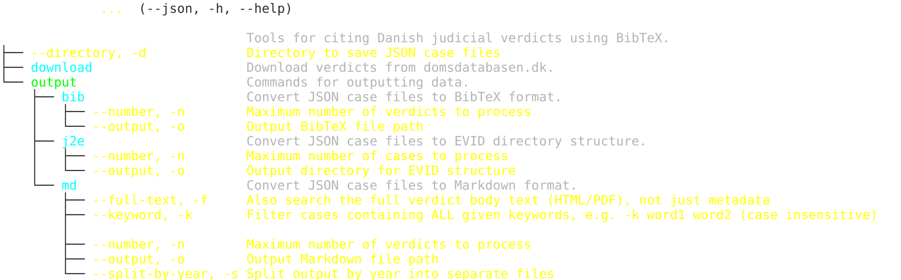

# domdb

Tools translating Danish judicial verdicts to BibTeX or Markdown, for use in LaTeX or typst.

## Features
- Download Danish judicial verdicts from domsdatabasen.dk
- Convert JSON verdict data to BibTeX, Markdown, or EVID format

## Installation

```bash
uv pip install git+https://github.com/evidlabel/domdb.git
domdb -h
```

**Note**: To use this tool, you must obtain a username and password from [Domsdatabasen](https://domsdatabasen.dk/spoergsmaal-og-svar/api-adgang-til-domsdatabasen/) to access the domsdatabasen.dk API.

## Usage



### Download Verdicts
```sh
domdb download
```
Downloads the latest verdicts into the local verdicts storage. Each verdict contains the full PDF, so `download` only fetches new entries rather than re-downloading everything.

### JSON to BibTeX
```sh
# Basic conversion
domdb output bib

# With custom paths and limit
domdb output bib -d ./cases -o ./references.bib -n 100
```

### JSON to Markdown
```sh
# Basic conversion
domdb output md

# With custom paths and limit
domdb output md -d ./cases -o ./cases.md -n 100

# Split by year into separate files
domdb output md -s True

# Filter cases containing a keyword
domdb output md -k "erstatning"
```

### JSON to EVID
```sh
domdb output j2e
domdb output j2e -d ./cases -o ./evid -n 100
```

### Using with [typst](https://typst.app/)

```bash
wget https://raw.githubusercontent.com/evidlabel/domdb/master/resources/cases.bib -O cases.bib
echo "Citing all verdicts:
#bibliography(\"cases.bib\",full:true)" > all.typ
typst compile all.typ
```

## Configuration

Set environment variables:
```sh
export DOMDB_USER_ID="your_user_id"
export DOMDB_PASSWORD="your_password"
```

Default cases directory: `~/domdatabasen/cases` — override with `-d/--directory`.

## Development

```sh
uv run pytest
```

## License
MIT License

## Disclaimer

`domdb` is a tool for converting a publicly available Danish database of verdicts into BibTeX format for use in LaTeX or typst.
It does *not* provide legal advice or interpret legal content.

The tool processes and represents data from `domsdatabasen.dk` which is a public source, without modification to the original content, other than for the purposes of correct rendering in LaTeX.

Users are responsible for verifying the accuracy and applicability of the data for their purposes.

`domdb` does not publish the content of the verdicts because they may be subject to modification, in particular through updated pseudonymization. If you need the content of the verdicts, apply for API access.
