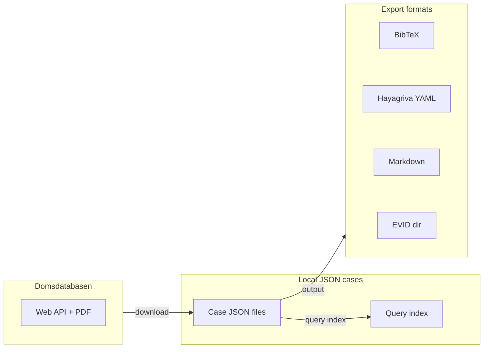

# Domdb

**Domdb** is a CLI toolkit for downloading, searching, and citing Danish judicial verdicts from [Domsdatabasen](https://domsdatabasen.dk). It fetches verdicts as JSON, lets you query them with keyword, court, subject, or date filters, and exports them to multiple formats for use in LaTeX, Typst, Markdown, and evidence directories.

## Architecture



## Commands at a glance

| Command | Purpose |
|---------|---------|
| `domdb download` | Download verdicts from domsdatabasen.dk |
| `domdb query` | Search cached verdicts (index, count, list) |
| `domdb output` | Export to BibTeX, Hayagriva YAML, Markdown, or EVID |

## Global options

| Flag | Description |
|------|-------------|
| `--directory, -d` | Directory to save JSON case files (default: `~/domdatabasen/cases`) |
| `--json, -j` | Output in JSON format |
| `--help, -h` | Show help message |
| `--version, -V` | Show version |

## Quick start

```bash
# Download cases
domdb download

# Search for verdicts
domdb query list --keyword "trafik"

# Export to BibTeX
domdb output bib
```

For a full walkthrough, see [Getting Started](guides/getting-started).