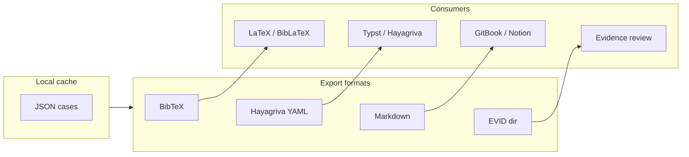

# Output Formats

Domdb supports four export formats via `domdb output <format>`. All formats read from the JSON case files stored in your `--directory` (default: `~/domdatabasen/cases`).

## Architecture



## BibTeX

Export to standard BibTeX format for use with LaTeX and BibLaTeX.

```bash
# Export all cases
domdb output bib

# Export to custom file, limited to 100 cases
domdb output bib --output my-citations.bib --number 100
```

| Flag | Default | Description |
|------|---------|-------------|
| `--number, -n` | `-1` (all) | Maximum number of verdicts to process |
| `--output, -o` | `resources/cases.bib` | Output BibTeX file path |

Each verdict is exported as a `@misc` entry with fields for court, date, case number, and summary.

## Hayagriva YAML

Export to Hayagriva YAML format for use with [Typst](https://typst.app/) and the Hayagriva citation manager.

```bash
# Export all cases
domdb output hay

# Export to custom file, limited to 50 cases
domdb output hay --output citations.yml --number 50
```

| Flag | Default | Description |
|------|---------|-------------|
| `--number, -n` | `-1` (all) | Maximum number of verdicts to process |
| `--output, -o` | `resources/cases.yml` | Output Hayagriva YAML file path |

Each entry uses Hayagriva `type: Case` with title, court author, date, case number (`serial-number`), subjects, and URL. Use with Typst `#bibliography("references.yml")`.

## Markdown

Export to Markdown format for documentation platforms, GitBooks, or Notion.

```bash
# Export all cases to single file
domdb output md

# Split by year into separate files
domdb output md --split-by-year

# Filter by keywords
domdb output md --keyword "trafik ulykke"

# Full-text search (searches verdict body, not just metadata)
domdb output md --keyword "arbejdsulykke" --full-text
```

| Flag | Default | Description |
|------|---------|-------------|
| `--number, -n` | `-1` (all) | Maximum number of verdicts to process |
| `--output, -o` | `resources/cases.md` | Output Markdown file path |
| `--split-by-year, -s` | `False` | Split output by year into separate files |
| `--keyword, -k` | — | Filter cases containing ALL given keywords (case insensitive) |
| `--full-text, -f` | `False` | Also search the full verdict body text (HTML/PDF), not just metadata |

## EVID directory

Export to an EVID directory structure for evidence review workflows. Each verdict becomes a structured entry within the output directory.

```bash
# Export to default evid/ directory
domdb output j2e

# Export to custom directory, limited to 200 cases
domdb output j2e --output ./my-evidence --number 200
```

| Flag | Default | Description |
|------|---------|-------------|
| `--number, -n` | `-1` (all) | Maximum number of cases to process |
| `--output, -o` | `evid` | Output directory for EVID structure |

Scanned (image-only) PDFs are skipped during text extraction rather than emitting empty per-page sections.